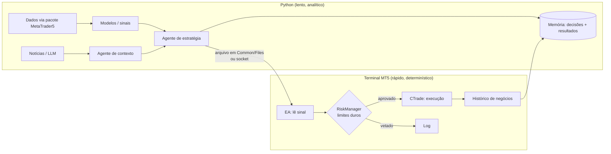

# 🧠 Arquitetura: agentes de IA sobre o MetaTrader 5

Ponte entre a [base conceitual](fundamentos/agentes-financeiros.md) e a prática no MT5.

O padrão de sistemas de agentes financeiros:

> signal → strategy → risk → execution → memory

No MT5, cada papel tem um lugar natural:

| Papel do agente | Onde vive no MT5 | Cadência | Determinístico? |
|---|---|---|---|
| **Signal** (preço, indicadores) | indicadores MQL5 / pandas | tick ou candle | sim |
| **Strategy** (tese bull/bear) | lógica do EA / modelo em Python | candle | sim (modelo) |
| **Contexto** (notícias, regime, macro) | Python + LLM | minutos a horas | não |
| **Risk** (exposição, drawdown) | **dentro do EA** (`RiskManager.mqh`) | todo tick | **sempre sim** |
| **Execution** (ordens, timing) | `CTrade` no EA | tick | sim |
| **Memory** (decisões + resultados) | histórico de negócios + banco/CSV + `diario/` | contínua | — |

## Diagrama

## Três formas de integrar

### 1. MQL5 puro
Toda a lógica no EA.
- ✅ Backtestável no Strategy Tester, baixa latência, sem dependências
- ❌ Difícil usar ML/LLM e bibliotecas de dados
- 👉 **Comece aqui** (Fases 2–3)

### 2. Python controla tudo
Script em loop: lê dados → decide → `order_send`.
- ✅ Todo o ecossistema Python disponível
- ❌ Polling, sem backtest nativo, risco fica fora do terminal (se o script travar, ninguém protege a posição)

### 3. Híbrido: Python decide, EA executa e protege ⭐
Python publica um **sinal** (direção, confiança, validade); o EA lê, aplica limites de risco e executa.
- ✅ Inteligência em Python + execução e risco robustos no terminal
- ✅ Se o Python cair, o EA continua protegendo posições (stops, limite diário, expiração de sinal)
- 👉 **Objetivo da Fase 5**

Canais de comunicação:
| Canal | Como | Observação |
|---|---|---|
| Arquivo | Python grava JSON/CSV em `%APPDATA%\MetaQuotes\Terminal\Common\Files`; EA lê com `FileOpen(..., FILE_COMMON)` em `OnTimer` | mais simples; o MQL5 só acessa arquivos dentro de `MQL5/Files` ou `Common/Files` |
| Socket | `SocketCreate`/`SocketConnect` no EA (cliente) ↔ servidor Python | menor latência; exige liberar o host em *Opções → Expert Advisors* |
| HTTP | `WebRequest` no EA ↔ API Python | fácil de depurar; também exige liberar a URL |

## Princípios de design

1. **Risco nunca é delegado a um LLM.** Limites são código determinístico dentro do EA, com precedência sobre qualquer sinal.
2. **LLM fora do caminho crítico.** A latência (segundos) e a não-determinância servem para contexto e regime, não para decidir cada tick.
3. **Sinais expiram.** Todo sinal externo tem timestamp e validade. Sinal velho é ignorado.
4. **Tudo é logado.** Entrada do agente, decisão do risco, execução e resultado alimentam a memória.
5. **Cuidado com backtest de LLM.** Modelos treinados com dados até certa data "já viram" o passado. Backtests de agentes LLM em períodos anteriores ao corte de treino têm **vazamento de informação**. Valide em dados posteriores ao corte ou em paper trading.
6. **Fallback seguro.** Sem sinal ou com erro de comunicação, o EA fica **flat** ou só gerencia posições existentes.

## Conexão com o landscape

As firmas do [landscape](fundamentos/landscape-quant.md) seguem a mesma separação em escala industrial: pesquisa e modelos (lento) separados de execução e risco em tempo real (rápido). Guardadas as proporções, a arquitetura híbrida é a versão individual desse modelo.
